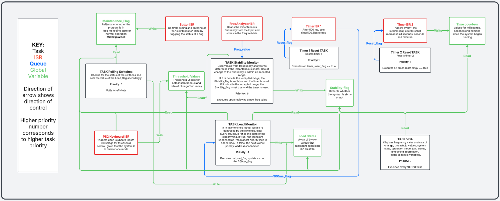

# COMPSYS-723-Assignment-1
# Frequency Relay Monitor

## Group 19:
Mardee Bayron - Tim Cashmore - Joel Henderson

---

# Operation of the System

---

## Table of Contents

1. [Boot Up](#boot-up)  
2. [Push-Buttons](#push-buttons)  
3. [Normal Mode](#normal-mode)  
   - [Switches](#normal-mode-switches)  
   - [LEDs](#normal-mode-leds)  
4. [Maintenance Mode](#maintenance-mode)  
   - [Switches](#maintenance-mode-switches)  
   - [LEDs](#maintenance-mode-leds)  
   - [PS/2 Keyboard](#ps2-keyboard)  
5. [VGA Display](#vga-display)

---

## Boot Up

to initially setup the board and eclipse our final implementation is in the ffrequency_analyser folder. 
The project should be called freqyAnalyser (ffrequency_analyser > software > freqyAnalyser)
We have also placed the freq_relay_controller.sof file needed to first program the DE2-115 board in
the "program_files" folder

Once the system has booted, it starts in **Normal Mode**.

---

## Push-Buttons

- **Left‑most 3 buttons**  
  Toggle between **Normal Mode** and **Maintenance Mode**.  
- **Right‑most button**  
  Resets the program.

- **Display Indicators:**  
    VGA and LCD displays show the current mode 
    - 7-segment display also shows the current mode:
        - `E` = Maintenance Mode  
        - `0` = Normal Mode  

---

## Normal Mode

In Normal Mode, the system automatically controls loads based on stability and load monitors.

- **Display:**  
  - Shows each load’s state (active/disconnected).  
  - On the right side:  
    - Recent reaction times (time between stability change and load state change)  
    - Maximum, minimum, and average reaction times  

### Switches

- **Right‑most 5 switches**  
  - Manually disconnect a load when turned OFF.  
  - When turned back ON, the load will only reactivate if:  
    1. The system is stable  
    2. The load monitor reconnects it  
- **Other switches** have no function in this mode.

### LEDs

- **Red LEDs** indicate **active** loads.  
- **Green LEDs** indicate **disconnected** loads.

---

## Maintenance Mode

In Maintenance Mode, the user has direct control over loads and threshold settings.

### Switches

- **Right‑most 5 switches**  
  - Fully control connection/disconnection of each load.  
  - When returning to Normal Mode, the current switch states remain, and the load monitor will reconnect loads based on system stability.  
- **Other switches** have no function in this mode.

### LEDs

- **Red LEDs** still indicate **active** loads.  
- **Green LEDs** are **disabled**.

### PS/2 Keyboard

While in Maintenance Mode, use the keyboard to adjust threshold values:

| Key            | Function                                                                                  |
| -------------- | ----------------------------------------------------------------------------------------- |
| **Up Arrow**   | Select the **Instantaneous Frequency Threshold** for editing                              |
| **Down Arrow** | Select the **Rate-of-Change (ROC) Threshold** for editing                                 |
| **Left Arrow** | Decrement the selected threshold value by 1                                               |
| **Right Arrow**| Increment the selected threshold value by 1                                               |

- The selected threshold to edit is highlighted on the VGA display.  
- When you switch back to Normal Mode, the new threshold values are saved and used by the stability monitor.

---

## VGA Display

The VGA output presents real‑time graphs, status, and timing data:

1. **Top Graphs (2 seconds range)**  
   - **Left:** Instantaneous frequency over time  
   - **Right:** Rate of change of frequency over time  

2. **Thresholds & Instantaneous Values**  
   - Below the graphs:  
     - Instantaneous frequency value  
     - Instantaneous ROC value  
     - Configured thresholds for both  

3. **Mode & Stability**  
   - To the right of thresholds:  
     - **System State:** Stable / Unstable  
     - **Operation Mode:** Normal / Maintenance  

4. **Timing Information**  
   - Further right:  
     - **Uptime:** Total time system has been operating  
     - **Recent Reaction Times:** Last 5 reaction times  
     - **Max / Min / Average Reaction Time**

5. **Load States**  
   - Bottom of the screen: Active/disconnected state of all loads  

---

## Initial Conceptual Design

---

## Final Implemented Design

---